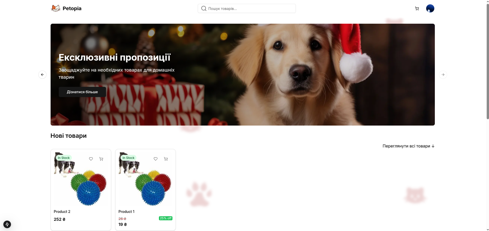
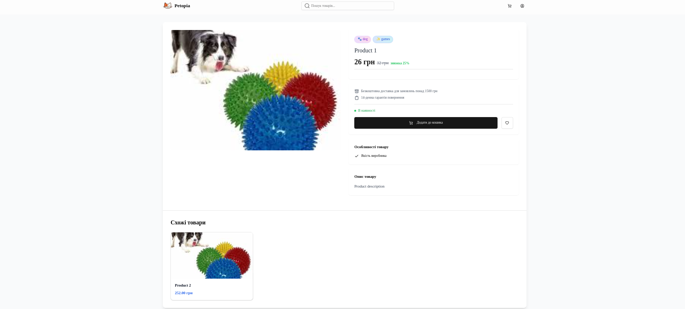
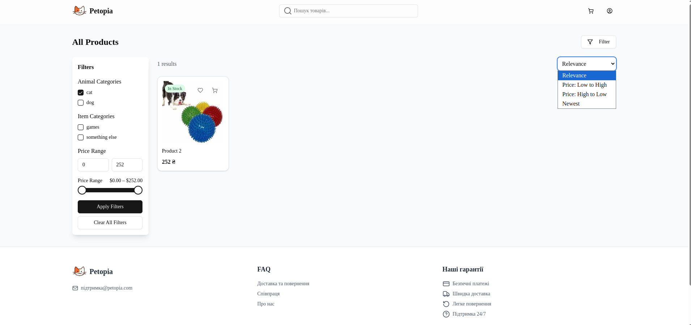
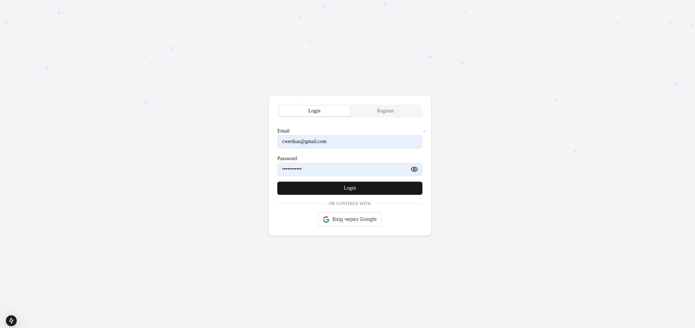

# 🐾 Petopia - Pet Store Project


<details>
<summary><b>🇬🇧 English Version (click to expand)</b></summary>

# 🐾 Petopia - Pet Store Project

Petopia is a development project showcasing a pet store web application. This is a demonstration/portfolio project built with Django REST Framework for the backend and Next.js for the frontend, and is not a production application.

## 🎯 Project Overview

This project demonstrates my skills in creating a modern e-commerce platform for pet products. It's designed to show implementation of various features common in online stores, using modern web development technologies. This project is under active development and serves primarily as a portfolio piece.

<div align="center">
    
</div>

## 📌 Featured Implementations

- 🛒 Shopping cart functionality with CRUD operations
- 👤 User authentication system with Google OAuth integration
- ❤️ Wishlist implementation for saving products
- 🔍 Search and filtering capabilities
- 💳 LiqPay payment integration (test mode only)
- 📦 Order management and history tracking
- 📱 Responsive design implementation

## 💻 Technology Stack

- **Frontend**: Next.js, React, Tailwind CSS, Framer Motion, Axios
- **Backend**: Django, Django REST Framework, PostgreSQL, Simple JWT for authentication, Social Auth for Google integration
- **Infrastructure**: Docker and Docker Compose for development environment setup

## 🚀 Setup for Development

### Using Docker (recommended):

```bash
# Clone the repository
git clone https://github.com/clone/petopia.git
cd petopia

# Create .env file from example
cp .env.example .env

# Edit .env with your development settings
nano .env

# Launch development containers
docker-compose up -d
```

### Local development setup:

```bash
# Frontend setup
cd Frontend/petopia
npm install
npm run dev

# Backend setup
cd Backend/petopia
python -m venv venv
source venv/bin/activate  # On Windows: venv\Scripts\activate
pip install -r requirements.txt
python manage.py migrate
python manage.py runserver
```

## 📄 License

This project is distributed under the MIT license. See the [LICENSE](LICENSE) file for details.

</details>

## 🎯 Про проект

Petopia - це навчальний/демонстраційний проект веб-додатку для зоомагазину. Це не виробничий сайт, а демонстрація навичок веб-розробки з використанням Django REST Framework для бекенду та Next.js для фронтенду.

<div align="center">
    
</div>

## 📌 Впроваджені можливості

<details>
<summary><b>👉 Розгорнути детальний опис можливостей</b></summary>

- 🛒 **Функціонал кошика для покупок** з можливістю додавання, видалення та редагування кількості товарів
- 👤 **Система автентифікації** з інтеграцією Google OAuth, профілями та адресами доставки
- ❤️ **Список бажань** для збереження обраних товарів
- 🔍 **Пошук і фільтрація** товарів за різними параметрами
- 💳 **Інтеграція з LiqPay** (в тестовому режимі) для демонстрації процесу оплати
- 📦 **Керування замовленнями** та історія покупок у особистому кабінеті
- 📱 **Адаптивний дизайн** для демонстрації на різних пристроях
- 🌟 **Система відгуків та оцінок** для товарів (частково реалізовано)
- 🔔 **Функціонал сповіщень** (в розробці)

</details>

## 💻 Технічний стек

<details>
<summary><b>👉 Розгорнути повний технічний опис</b></summary>

### Frontend
- **Next.js** з серверними компонентами для оптимізації рендерингу
- **React** з функціональними компонентами та хуками
- **Tailwind CSS** для стилізування інтерфейсу
- **Framer Motion** для анімацій в інтерфейсі
- **Axios** для роботи з HTTP запитами
- **React Query** для кешування даних (частково впроваджено)
- **React Hook Form** для обробки форм

### Backend
- **Django** як основний фреймворк
- **Django REST Framework** для створення API
- **PostgreSQL** для зберігання даних
- **Simple JWT** для автентифікації
- **Social Auth** для інтеграції з Google OAuth
- **Celery** для асинхронних задач (в процесі впровадження)
- **Redis** для кешування (в процесі впровадження)

### Інфраструктура
- **Docker і Docker Compose** для контейнеризації середовища розробки
- **Nginx** в якості проксі-сервера
- **GitHub Actions** для CI/CD (в процесі налаштування)
- **AWS S3** для зберігання медіа-файлів (в планах)

</details>

## 🚀 Встановлення для розробки

<details>
<summary><b>Використання Docker (рекомендовано)</b></summary>

```bash
# Клонувати репозиторій
git clone https://github.com/gh0stluko/petopia.git
cd petopia

# Створити файл .env на основі прикладу
cp .env.example .env

# Відредагувати файл .env для середовища розробки
nano .env

# Запустити контейнери розробки
docker-compose up -d
```
</details>

<details>
<summary><b>Локальне встановлення для розробки</b></summary>

```bash
# Для встановлення та запуску фронтенду:
cd Frontend/petopia
npm install
npm run dev

# Для встановлення та запуску бекенду:
cd Backend/petopia
python -m venv venv
source venv/bin/activate  # На Windows: venv\Scripts\activate
pip install -r requirements.txt
python manage.py migrate
python manage.py runserver
```
</details>

## 📊 Адміністративний інтерфейс

Проект включає адмін-панель для демонстрації керування товарами, замовленнями та користувачами:

<details>
<summary><b>👉 Переглянути скріншоти</b></summary>
<div align="center">
    <div>
        
        
    </div>
    <div>
        
        
    </div>
</div>
</details>

## 🌐 Змінні середовища

Для розробки створіть файл `.env` у кореневій директорії проекту з такими змінними:

```
# Django Settings
SECRET_KEY=your_secret_key
DEBUG=True
ALLOWED_HOSTS=localhost,127.0.0.1

# Database Settings
DB_NAME=petopia
DB_USER=postgres
DB_PASSWORD=postgres
DB_HOST=db
DB_PORT=5432

# Google OAuth Settings (для тестування)
GOOGLE_CLIENT_ID=your_test_google_client_id
GOOGLE_CLIENT_SECRET=your_test_google_client_secret

# LiqPay Settings (тестовий режим)
LIQPAY_PUBLIC_KEY=your_test_liqpay_public_key
LIQPAY_PRIVATE_KEY=your_test_liqpay_private_key

# Email Settings (для тестування)
EMAIL_HOST=smtp.gmail.com
EMAIL_PORT=587
EMAIL_HOST_USER=your_test_email@gmail.com
EMAIL_HOST_PASSWORD=your_test_app_password
```

## 📄 Ліцензія

Цей проект розповсюджується під ліцензією MIT. Детальніше у файлі [LICENSE](LICENSE).

